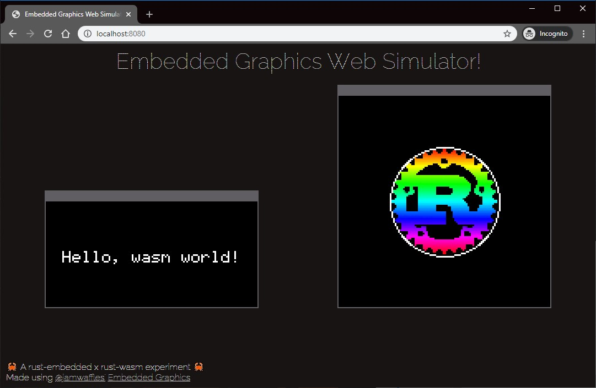

# Embedded Graphics Web Simulator

The web simulator is based on [embedded-graphics-simulator](https://docs.rs/embedded-graphics-simulator/0.2.0/embedded_graphics_simulator/).
This is a sample project demonstrating using a `no_std` rust-embedded library with Webassembly.

The Web Simulator allows you to use a browser to test embedded-graphics code and run graphics. There is no need to install SDL and its development libraries for _running_ the project. You can see [the demo here](https://rahul-thakoor.github.io/embedded-graphics-web-simulator/).


## For Development

This library is intended to be used in Rust + Webassembly projects. Check the examples which illustrate how to use the library. Look at the [examples](https://github.com/embedded-graphics/simulator/tree/master/examples) in the Embedded Graphics Simulator project for inspiration. You can use [wasm-pack](https://rustwasm.github.io/wasm-pack/) or [trunk](https://trunkrs.dev/)and add this library as a dependency 

Usage example:

```rust
use embedded_graphics_web_simulator::{
    display::WebSimulatorDisplay, output_settings::OutputSettingsBuilder,
};
use wasm_bindgen::prelude::*;
use web_sys::console;

use embedded_graphics::{
    image::Image,
    mono_font::{ascii::FONT_6X9, MonoTextStyle},
    pixelcolor::Rgb565,
    prelude::{Point, Primitive, WebColors},
    primitives::{Circle, PrimitiveStyle},
    text::Text,
    Drawable,
};

use tinybmp::Bmp;

// When the `wee_alloc` feature is enabled, this uses `wee_alloc` as the global
// allocator.
//
// If you don't want to use `wee_alloc`, you can safely delete this.
#[cfg(feature = "wee_alloc")]
#[global_allocator]
static ALLOC: wee_alloc::WeeAlloc = wee_alloc::WeeAlloc::INIT;

// This is like the `main` function, except for JavaScript.
#[wasm_bindgen(start)]
pub fn main_js() -> Result<(), JsValue> {
    // This provides better error messages in debug mode.
    // It's disabled in release mode so it doesn't bloat up the file size.
    #[cfg(debug_assertions)]
    console_error_panic_hook::set_once();

    let document = web_sys::window().unwrap().document().unwrap();

    let output_settings = OutputSettingsBuilder::new()
        .scale(1)
        .pixel_spacing(1)
        .build();
    let mut text_display = WebSimulatorDisplay::new((128, 64), &output_settings, None);
    let mut img_display = WebSimulatorDisplay::new(
        (128, 128),
        &output_settings,
        document.get_element_by_id("custom-container"),
    );

    let style = MonoTextStyle::new(&FONT_6X9, Rgb565::CSS_WHITE);

    if Text::new("Hello, wasm world!", Point::new(10, 30), style)
        .draw(&mut text_display)
        .is_err()
    {
        console::log_1(&"Couldn't draw text".into());
    }

    // Load the BMP image
    let bmp = Bmp::from_slice(include_bytes!("./assets/rust-pride.bmp")).unwrap();
    let image = Image::new(&bmp, Point::new(32, 32));
    if image.draw(&mut img_display).is_err() {
        console::log_1(&"Couldn't draw image".into());
    }

    if Circle::new(Point::new(29, 29), 70)
        .into_styled(PrimitiveStyle::with_stroke(Rgb565::CSS_WHITE, 1))
        .draw(&mut img_display)
        .is_err()
    {
        console::log_1(&"Couldn't draw circle".into());
    }

    img_display.flush().expect("Couldn't update");
    Ok(())
}

```

### How it works

Embedded Graphics Web Simulator implements [`DrawTarget`](https://docs.rs/embedded-graphics/0.6.0/embedded_graphics/prelude/trait.DrawTarget.html) for the HTML `<canvas>` element.
It will attach a `<canvas>` either to the document body, or to a user-supplied parent element.
To minimize overhead, draw operations need to be explicitly `flush()`ed whenver you want to see an actual update.

## Credits

This project is based on the [embedded-graphics](https://github.com/embedded-graphics/simulator) library, originally by @jamwaffles


### Tools
-  [wasm-pack](https://rustwasm.github.io/wasm-pack/)
- [cargo-run-wasm](https://crates.io/crates/cargo-run-wasm)


Thanks to all contributors :)